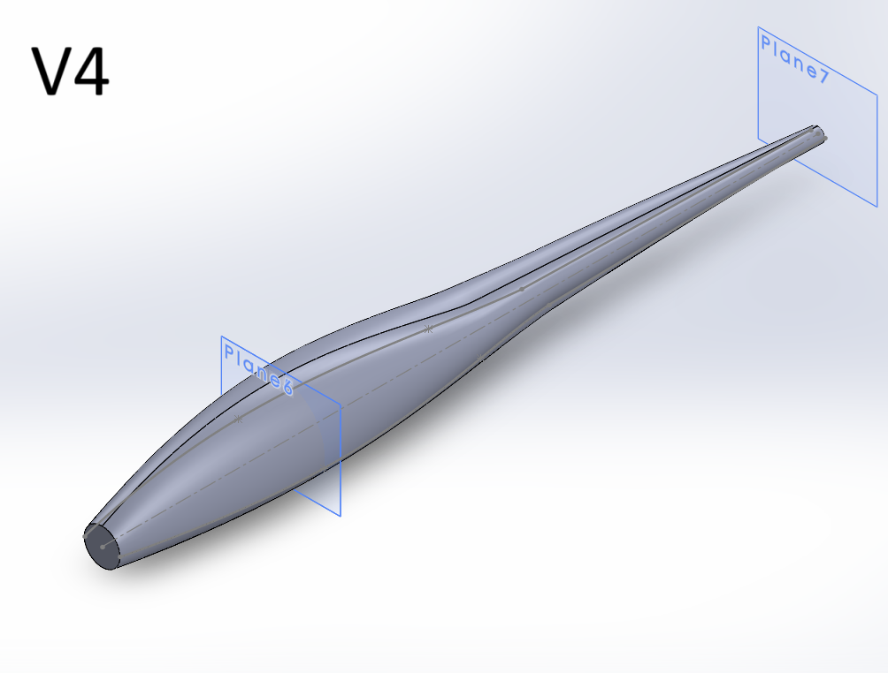

# ARRC-Fixed-Wing

## 1.0 Introduction  
The following is my work in designing a fixed-wing aircraft in UBCO's Aeronautics, Robotics, and Rocketry Club (ARRC). I am responsible for designing the aircraft's fuselage; however, I also worked on the airfoil analysis. I will talk through my XFLR5 analysis and the different iterations I made for the aircraft fuselage.  

## 2.0 Airfoil Analysis (XFLR5)  
The fuselage is to be 3D printed with lightweight PLA. This is a gamble as we still expected the weight to be quite significant in comparison to using foam parts. However, this has paid off, which I will explain when describing Version 5.  

## 3.0 Aircraft Fuselage  

### <u>Versions 1, 2, 3, and 4</u>  
Versions 1, 2, and 3 were iterations where I tried to figure out the best shape for the fuselage. Unlike the baffle design for the water tank, where each iteration had a clear aim of improving upon the previous iteration's weaknesses through changing the geometry of the baffle, Versions 1 to 4 of the fuselage were more of me trying different things to see how they would look and how much they would weigh. I have no experience in fuselage design prior to this, thus Versions 1 to 4 are more of a showcase of me finding my way instead of demonstrating technical skill. :)  

<table>
  <tr>
    <td></td>
    <td></td>
  </tr>
  <tr>
    <td></td>
    <td></td>
  </tr>
</table>

V1's fuselage began as a circle where the motor is placed. It then expands horizontally. This was done to fit the battery in. I later learned that the size of the battery is similar to the size of the motor, which then led to V2—a fuselage that accommodated the motor and the battery at the front and gradually dipped down towards the tail section. Although this *technically* works, it looks like a snake that swallowed a battery and a motor, and conventional wisdom states that the uglier it looks, the worse it flies (Have you seen early supersonic British jets by chance?). This, in turn, led to Versions 3 and 4, which aimed to improve aesthetics and functionality at the same time.  

### <u>Version 5</u>  
It occurred to me that V4 is a massive waste of material. I need to:  

- Minimize weight  
- Minimize drag  

While maximizing:  

- Internal space  
- Structural strength  

Let's start with minimizing weight. V4's connection to the tail does not need to be 3D printed. Instead, let's use something light and strong—a carbon fiber rod—to connect the tail to the front fuselage. Then let's minimize drag, which can be done by reducing the frontal area (generally) and CFD simulations. Let's begin with reducing the frontal area first. Instead of having the frontal hump seen in V4, we will conform to our bottleneck, which is going to be the battery and the motor.  

As you can see, V5's fuselage is cylindrical. Although I could remove more material around the battery, I think choosing a cylinder achieves an adequate balance between weight, structural strength, and internal volume for this case. As for the rest of the design, you can see in the cross-section view where the battery and the motor are to be placed. Additional work needs to be done as the wing has been redesigned to contain a higher poly-count. Additionally, mounting plates also need to be designed for the motor, but this version is close to being finished! I will update this as I go!  

